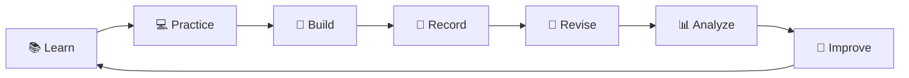
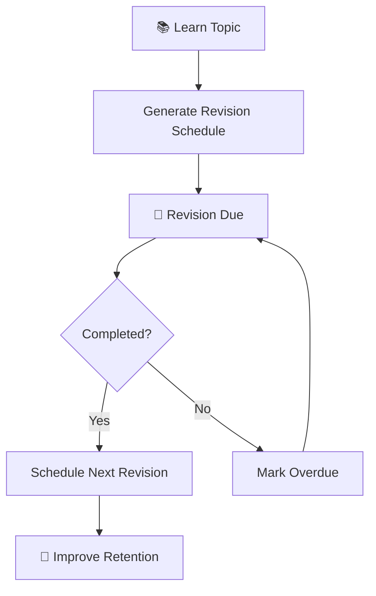
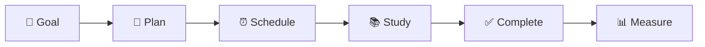
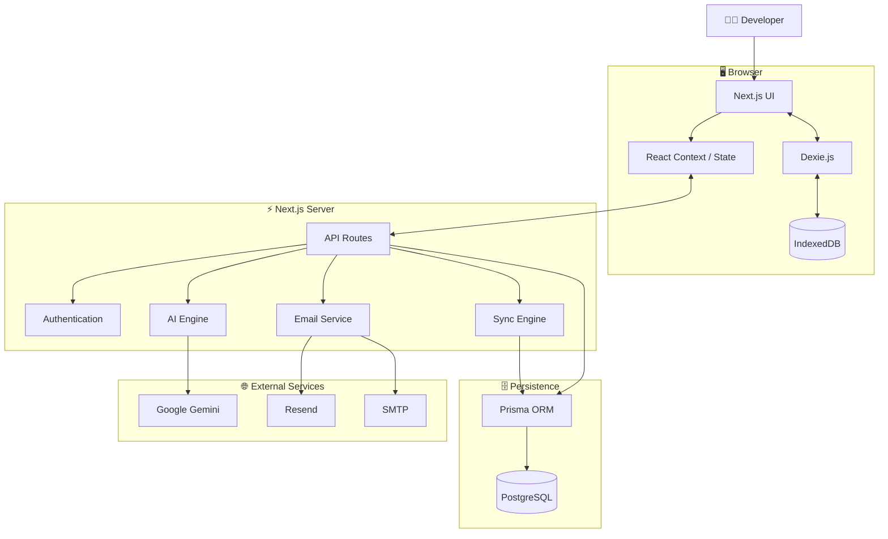
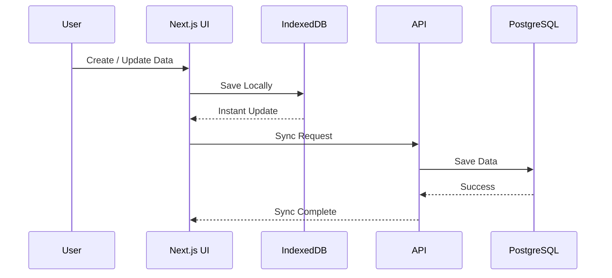
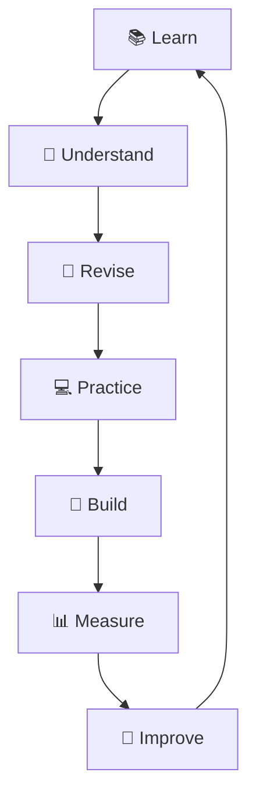

<div align="center">

# 🧠 DevOS

### Developer Second Brain

<p>
  <strong>A developer-focused operating system for learning, building, revising, and growing.</strong>
</p>

<p>
  DevOS brings your learning, projects, DSA, notes, revisions, planning, analytics, and AI assistance into one connected workspace.
</p>

<br />


<br /><br />


<br /><br />

<a href="#-features">Features</a>
 •  <a href="#-architecture">Architecture</a>
 •  <a href="#-tech-stack">Tech Stack</a>
 •  <a href="#-getting-started">Getting Started</a>
 •  <a href="#-roadmap">Roadmap</a>

</div>

---

# 🚀 What is DevOS?

> **DevOS is a Developer Second Brain.**

Software developers learn continuously.

But their journey is usually scattered across different applications.

```text
📚 Learning        → Documentation / Courses
🧠 Revision        → Memory
💻 DSA             → Coding Platforms
🚀 Projects        → GitHub
📝 Notes           → Notion / Obsidian
🔗 Resources       → Browser Bookmarks
📅 Planning        → Todo Applications
⏱ Focus           → Pomodoro Apps
📊 Progress        → Spreadsheets
```

DevOS brings these workflows into one connected system.

```text
                         ┌───────────────────┐
                         │       DevOS       │
                         │ Developer Brain   │
                         └─────────┬─────────┘
                                   │
        ┌──────────────┬───────────┼───────────┬──────────────┐
        │              │           │           │              │
        ▼              ▼           ▼           ▼              ▼

    Learning       Revision       DSA       Projects        Notes

        │              │           │           │              │
        └──────────────┴───────────┼───────────┴──────────────┘
                                   │
                                   ▼

                              Resources

                                   │
                                   ▼

                               Planner

                                   │
                                   ▼

                                Timer

                                   │
                                   ▼

                               Analytics
```

The goal is simple:

# 🤔 What should I focus on today?

DevOS is designed to help answer that question.

---

# ✨ Why DevOS?

DevOS is not just a task manager.

It is designed around the **developer growth cycle**.



Every module contributes to this loop.

---

# 🔥 Highlights

<table>
<tr>
<td width="50%">

## ⚡ Offline First

Instant local data access using:

* Dexie.js
* IndexedDB
* Local-first workflows

</td>

<td width="50%">

## ☁️ Cloud Persistence

Two-way synchronization with:

* Next.js API
* Prisma ORM
* PostgreSQL

</td>
</tr>

<tr>
<td width="50%">

## 🤖 AI Copilot

Context-aware assistance powered by:

* Google Gemini
* Learning context
* Revision data
* DSA progress

</td>

<td width="50%">

## 🧠 Smart Revision

Spaced repetition system for:

* Better retention
* Revision scheduling
* Learning consistency

</td>
</tr>

</table>

---

# ✨ Features

## 🏠 Command Center

Your developer dashboard.

A single place to understand your current progress.

```text
🔥 Learning Streak

📚 Topics In Progress

🧠 Revisions Due

⏱ Study Time

🎯 Today's Focus

💻 DSA Progress

🚀 Active Projects

📊 Weekly Activity
```

Instead of opening multiple applications:

> Open DevOS and see what needs your attention.

---

# 🤖 AI Copilot

DevOS includes a context-aware developer assistant.

The AI can understand your current DevOS activity.

```text
Your Learning Data
        │
        ▼
Your Revision Status
        │
        ▼
Your DSA Progress
        │
        ▼
      AI Context
        │
        ▼
🤖 Personalized Assistance
```

### AI Capabilities

* 📚 Study planning
* 🧠 Revision guidance
* 💻 DSA assistance
* 🎯 Learning recommendations
* 💡 Technical explanations

The AI is designed to provide more useful assistance by understanding your current developer journey.

---

# 📚 Learning Tracker

Track your technical knowledge in a structured way.

```text
Technology
    │
    ▼
Topic
    │
    ▼
Subtopic
```

### Example

```text
React
 │
 └── Hooks
       │
       └── useEffect
```

Each topic can track:

| Property   | Example   |
| ---------- | --------- |
| Technology | React     |
| Topic      | Hooks     |
| Subtopic   | useEffect |
| Difficulty | Medium    |
| Confidence | 7/10      |
| Status     | Learning  |
| Study Time | 4.5 Hours |

---

# 🧠 Smart Revision

Learning something once is easy.

Remembering it is harder.

DevOS uses a spaced revision workflow.



### Revision Intervals

```text
Learn
  │
  ▼
Day 1
  │
  ▼
Day 2
  │
  ▼
Day 5
  │
  ▼
Day 7
  │
  ▼
Day 10
  │
  ▼
Day 15
  │
  ▼
Day 21
  │
  ▼
Day 30
  │
  ▼
Day 60
  │
  ▼
Day 90
```

---

# 💻 DSA Problem Vault

A dedicated workspace for Data Structures and Algorithms.

```text
DSA
│
├── Arrays
├── Strings
├── Hash Maps
├── Stacks
├── Queues
├── Linked Lists
├── Trees
├── Graphs
├── Dynamic Programming
├── Greedy
├── Sliding Window
└── Backtracking
```

Track:

```text
✓ Problems Solved

✓ Difficulty

✓ Patterns

✓ Struggle Points

✓ Key Takeaways

✓ Revision Schedule

✓ Confidence
```

---

# 🚀 Project Workspace

Track the projects you build.

```text
Project
│
├── 📄 Description
├── 💻 GitHub Repository
├── 🌐 Live Demo
├── 🛠 Tech Stack
├── 📋 Tasks
├── 💡 Ideas
└── 📊 Progress
```

Project progress:

```text
💡 Idea
   ↓
🏗 Building
   ↓
🧪 Testing
   ↓
🚀 Completed
```

---

# 📝 Developer Notes

Build your personal technical knowledge base.

```text
Notes
│
├── 💻 Code Snippets
├── 🧠 Technical Concepts
├── 🏗 Architecture
├── 📝 Quick Notes
├── 🔗 References
└── 💡 Ideas
```

> Learn something once. Store it properly. Find it when needed.

---

# 📖 Resource Library

Keep useful resources organized.

```text
📚 Documentation

🎥 YouTube

🎓 Courses

📕 Books

🐙 GitHub Repositories

📰 Articles

🛠 Tutorials
```

---

# 📅 Study Planner

Convert goals into action.



Features:

* Daily planning
* Study tasks
* Calendar view
* Estimated study time
* Completion tracking

---

# ⏱ Focus Timer

A built-in Pomodoro workspace.

```text
Start
  │
  ▼
🎯 Focus
  │
  ▼
☕ Short Break
  │
  ▼
🎯 Focus
  │
  ▼
🧠 Long Break
  │
  ▼
📊 Session Complete
```

### Default Intervals

| Mode          | Duration   |
| ------------- | ---------- |
| 🎯 Focus      | 25 Minutes |
| ☕ Short Break | 5 Minutes  |
| 🧠 Long Break | 15 Minutes |

---

# 📈 Analytics

Turn your activity into insights.

Track:

```text
📚 Learning Progress

⏱ Study Hours

🧠 Revision Completion

💻 DSA Progress

📅 Weekly Activity

📈 Learning Trends
```

Analytics should answer:

> What am I improving?

> Where am I weak?

> What am I ignoring?

> What should I focus on next?

---

# 🔔 Smart Notifications

DevOS can help you stay consistent.

Notification capabilities include:

```text
🧠 Revision Reminders

📚 Study Reminders

📅 Scheduled Tasks

📧 Daily Revision Digest
```

Email delivery supports:

* Resend
* SMTP
* Nodemailer

Automated reminders can be triggered through scheduled cron jobs.

---

# 🏗 Architecture

DevOS uses a **hybrid local-first architecture**.



---

# ⚡ Local-First + Cloud Sync

DevOS is designed to feel fast.

Data is first available locally.

```text
User Action
    │
    ▼
React UI
    │
    ▼
Dexie.js
    │
    ▼
IndexedDB
    │
    ▼
Instant UI Update ⚡
```

When synchronization is available:

```text
IndexedDB
    │
    ▼
Sync Engine
    │
    ▼
Next.js API
    │
    ▼
Prisma
    │
    ▼
PostgreSQL ☁️
```

This architecture combines:

```text
⚡ Local Speed

+

💾 Offline Persistence

+

☁️ Cloud Synchronization
```

---

# 🔄 Data Flow



---

# 🧰 Tech Stack

<div align="center">

### Core


<br/><br/>

### Styling


<br/><br/>

### Database


<br/><br/>

### Tools


</div>

<br />

| Category        | Technology          |
| --------------- | ------------------- |
| Framework       | Next.js 14          |
| UI              | React 18            |
| Language        | TypeScript          |
| Styling         | Tailwind CSS        |
| Animation       | Framer Motion       |
| UI Components   | Radix UI            |
| Local Database  | Dexie.js            |
| Browser Storage | IndexedDB           |
| Cloud Database  | PostgreSQL          |
| ORM             | Prisma              |
| AI              | Google Gemini       |
| Email           | Resend / Nodemailer |
| Charts          | Recharts            |
| Icons           | Lucide React        |

---

# 📂 Project Structure

```text
devos/
│
├── app/
│   │
│   ├── (auth)/
│   │   ├── login/
│   │   ├── signup/
│   │   ├── forgot-password/
│   │   └── reset-password/
│   │
│   ├── ai/
│   ├── analytics/
│   ├── dsa/
│   ├── learning/
│   ├── notes/
│   ├── planner/
│   ├── projects/
│   ├── resources/
│   ├── revision/
│   ├── settings/
│   ├── timer/
│   │
│   └── api/
│
├── components/
│   ├── auth/
│   ├── ui/
│   └── features/
│
├── context/
│
├── lib/
│   ├── ai-service.ts
│   ├── api-client.ts
│   ├── auth-server.ts
│   ├── db.ts
│   ├── email-service.ts
│   └── prisma.ts
│
├── prisma/
│   ├── schema.prisma
│   └── seed.ts
│
├── scripts/
│
├── public/
│
├── package.json
├── prisma.config.ts
├── tailwind.config.ts
├── tsconfig.json
└── vercel.json
```

---

# 🗄 Core Data Models

```text
User
 │
 ├── Learning Topics
 │      │
 │      └── Revision Entries
 │
 ├── DSA Problems
 │
 ├── Projects
 │
 ├── Notes
 │
 ├── Resources
 │
 ├── Planner Tasks
 │
 ├── Study Sessions
 │
 ├── Preferences
 │
 └── Revision Goals
```

---

# 🤖 AI Architecture

The DevOS AI Copilot uses application context.

```text
Learning Topics
       │
       ▼
Revision Data
       │
       ▼
DSA Progress
       │
       ▼
Planner Tasks
       │
       ▼
   Context Builder
       │
       ▼
Google Gemini
       │
       ▼
🤖 AI Response
```

This allows the AI to provide more relevant developer guidance.

---

# 🔐 Security

DevOS follows important security principles.

```text
User Request
      │
      ▼
Authentication
      │
      ▼
Authorization
      │
      ▼
Validation
      │
      ▼
Business Logic
      │
      ▼
Database
```

### Security Measures

```text
✓ Server-side authentication

✓ Protected API routes

✓ User ownership validation

✓ Secure environment variables

✓ Server-side secrets

✓ Input validation

✓ Password hashing

✓ Secure reset tokens
```

Never expose:

```text
DATABASE_URL

AI_API_KEY

RESEND_API_KEY

SMTP_PASSWORD

CRON_SECRET
```

---

# 🌱 Environment Variables

Create:

```text
.env.local
```

Example:

```env
# Database

DATABASE_URL=
DIRECT_URL=

# Environment

NODE_ENV=development

# Email

RESEND_API_KEY=
EMAIL_FROM=

# SMTP

EMAIL_HOST=
EMAIL_PORT=
EMAIL_USER=
EMAIL_PASSWORD=

# Cron

CRON_SECRET=

# AI

AI_API_KEY=
AI_MODEL=gemini-1.5-flash
```

> Never commit `.env.local`.

---

# 🚀 Getting Started

## Prerequisites

Make sure you have:

* Node.js 18+
* npm
* Git
* PostgreSQL

---

## 1. Clone

```bash
git clone https://github.com/abhigoud098/devos.git

cd devos
```

---

## 2. Install Dependencies

```bash
npm install
```

---

## 3. Configure Environment

Copy:

```bash
cp .env.example .env.local
```

Then configure your environment variables.

---

## 4. Configure Database

Push the Prisma schema:

```bash
npm run db:push
```

Optional seed data:

```bash
npm run db:seed
```

---

## 5. Start DevOS

```bash
npm run dev
```

Open:

```text
http://localhost:3000
```

---

# 🛠 Commands

| Command             | Description          |
| ------------------- | -------------------- |
| `npm run dev`       | Start development    |
| `npm run build`     | Production build     |
| `npm start`         | Start production     |
| `npm run lint`      | Run ESLint           |
| `npm run db:push`   | Push database schema |
| `npm run db:seed`   | Seed database        |
| `npm run db:studio` | Open Prisma Studio   |

---

# 🪟 Windows + OneDrive

DevOS includes a compatibility patch for Next.js projects running inside synchronized Windows directories such as OneDrive.

The patch handles filesystem reparse-point behavior that can affect Next.js build directories.

```text
Windows
   │
   ▼
OneDrive
   │
   ▼
.next Directory
   │
   ▼
Compatibility Patch
```

The patch is executed automatically during installation.

---

# ☁️ Deployment

DevOS is designed for deployment with:

```text
GitHub
   │
   ▼
Vercel
   │
   ▼
Next.js Application
   │
   ├── API
   ├── AI
   ├── Sync
   └── Cron
          │
          ▼
     PostgreSQL
```

### Deployment Steps

1. Push the repository to GitHub.
2. Import the project into Vercel.
3. Configure environment variables.
4. Configure PostgreSQL.
5. Configure AI credentials.
6. Configure email service.
7. Deploy.

---

# 🧪 Production Checklist

```text
[ ] npm run lint passes

[ ] npm run build passes

[ ] Database connection works

[ ] Prisma schema is configured

[ ] Authentication works

[ ] API routes work

[ ] Local persistence works

[ ] Cloud synchronization works

[ ] AI integration works

[ ] Email reminders work

[ ] Environment variables are configured

[ ] Secrets are not committed
```

---

# 🗺 Roadmap

## 🟢 Core

* [x] Developer Dashboard
* [x] Learning Tracker
* [x] Smart Revision
* [x] Local Persistence
* [x] Cloud Database
* [x] Authentication
* [x] AI Copilot
* [x] Study Timer

## 🟡 In Progress

* [ ] Advanced DSA Analytics
* [ ] Project Improvements
* [ ] Better Knowledge Graph
* [ ] Advanced Search
* [ ] Improved Sync System

## 🔵 Future

* [ ] Command Palette
* [ ] Global Search
* [ ] Keyboard Shortcuts
* [ ] Learning Heatmap
* [ ] Weak Topic Detection
* [ ] AI Learning Recommendations
* [ ] Import / Export
* [ ] Backup System
* [ ] Optional Team Collaboration

---

# 🔮 Vision

DevOS is designed to eventually understand a developer's entire learning journey.

```text
What are you learning?
        │
        ▼
What have you completed?
        │
        ▼
What are you forgetting?
        │
        ▼
What should you revise?
        │
        ▼
Where are you weak?
        │
        ▼
What should you practice?
        │
        ▼
What should you build?
        │
        ▼
How are you improving?
```

---

# 🧠 The DevOS Loop



---

# 🤝 Contributing

Contributions and suggestions are welcome.

```bash
git checkout -b feature/amazing-feature
```

Make your changes.

Before opening a pull request:

```bash
npm run lint

npm run build
```

Then:

```bash
git commit -m "Add amazing feature"

git push origin feature/amazing-feature
```

---

# 📄 License

This project is licensed under the **MIT License**.

---

<div align="center">

# 🧠 DevOS

### Developer Second Brain

<br/>

**Learn. Practice. Build. Revise. Improve. 🚀**

<br/>

Built with

**Next.js • React • TypeScript • Tailwind CSS**

**Dexie • IndexedDB • Prisma • PostgreSQL**

**Google Gemini • Resend**

<br/>

---

### ⭐ If you like DevOS, consider giving the repository a star!

</div>
